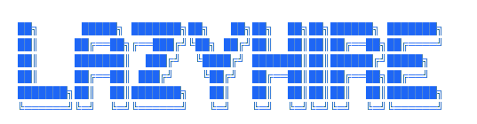

<p align="center"></p>

<p align="center">
<strong>
Resume in, applications out. &nbsp;&nbsp;
</strong>
</p>

<p align="center" width="100%">

</p>

<!-- Badges -->
<!--  -->

<!-- Hero GIF -->
<!--  -->

## The Problem

Job searching runs across too many tabs. You have the posting in one window, your resume in another, a blank cover letter doc open somewhere, and no consistent way to decide if a role is even worth applying to before you've already spent an hour on it.

`lazyhire` is built around one loop: build your profile once, add a job, get a fit score before writing anything, then generate what you need if you decide to apply. Everything stays local on your machine.

## Features

### Build your profile once

On first launch, import a hosted resume PDF or fill in your profile manually. `lazyhire` pulls out your experience, skills, targets, and deal-breakers and saves them locally. Every evaluation and every generated document draws from that profile, so you're not re-explaining yourself for each role.

<!--  -->

### Triage by score before spending time

Add a role from a URL or a pasted job description. `lazyhire` runs it against your profile and returns:

- an overall fit score
- matched and missing requirements
- seniority and role-fit breakdown
- a plain recommendation: apply, consider, or skip

That happens before you write anything, which is the point.

<!--  -->

### Generate tailored application material

For any saved job, generate a tailored resume PDF and cover letter PDF. Resume generation has multiple bullet-length presets and accepts an optional angle to steer the framing. Generated files attach back to the job record.

<!--  -->

### Prep interview answers

The answers workspace takes a question, classifies it, drafts a response in whatever tone you pick, and lets you refine it with follow-up instructions. Answers save to the job record so you can build a set before a screen or loop.

<!--  -->

### Source Jobs
Using Greenhouse/Ashby company slugs, find relevant jobs based on your resume criterias.

## Workflow

```text
Resume → Profile → Add Job → Evaluate Fit → Generate Resume / Cover Letter → Prep Answers
```

The tool works best when your profile is accurate and the job descriptions you paste are complete.

## Download

`lazyhire` is a desktop app (Electron + React), currently packaged for macOS.

> No packaged release has been published since the move to Electron yet — the [Releases page](https://github.com/snesjhon/lazyhire/releases) is still on the old CLI build. Until a new release goes out, build it yourself from source (see [Development](#development) below); it only takes a couple of commands.

Once releases resume, installing will be:

1. Download the latest `lazyhire-<version>.dmg` from [Releases](https://github.com/snesjhon/lazyhire/releases).
2. Open the `.dmg` and drag `lazyhire` into `Applications`.
3. Launch it from `Applications` (or Spotlight).

From then on, `lazyhire` checks for and installs new versions automatically on launch — no need to revisit the Releases page.

### Prerequisites

- macOS (Windows/Linux packaging isn't set up yet — see `electron-builder.yml`).
- Chrome (or a Chromium-based browser) — used for PDF generation. Set `CHROME_PATH` if yours isn't in a standard location.
- [Claude Code](https://github.com/anthropics/claude-code) installed and authenticated — evaluation and document generation run through it.

## Data

Everything is stored locally under `~/.lazyhire` (or `~/.lazyhire-dev` when running from source via `pnpm dev`, kept separate so local development never touches your real data):

- `.lazyhire/candidate.json`
- `.lazyhire/jobs.json`
- `.lazyhire/answers.json`

Generated PDFs attach back to the saved job records.

## Development

### Requirements

- [`pnpm`](https://pnpm.io) (see `packageManager` in `package.json` for the pinned version)
- Node.js 24 (LTS) — pinned in `.nvmrc`. Newer non-LTS Node versions (e.g. 26) are known to silently break Electron's own postinstall zip extraction, so stick to the pinned LTS.
- a working Claude Code setup, since evaluation and generation use `@anthropic-ai/claude-code`

### Setup

```bash
nvm use            # picks up the Node version pinned in .nvmrc
pnpm install
pnpm dev            # launches the Electron app in dev mode with hot reload
```

### Other scripts

| Command         | What it does                                                 |
| ---------------- | -------------------------------------------------------------- |
| `pnpm build`     | Type-checks and builds the app (via `electron-vite`)          |
| `pnpm build:mac` | Builds and packages a macOS `.dmg` (via `electron-builder`)   |
| `pnpm preview`   | Previews the built app                                        |
| `pnpm typecheck` | Runs `tsc --noEmit`                                            |

### Project layout

- `src/main/` — Electron main process: IPC handlers (`ipc/`), services (Claude integration, PDF generation, job-board sourcing), and prompt templates.
- `src/preload/` — the preload script bridging main and renderer.
- `src/renderer/` — the React renderer (screens, components, hooks).
- `src/shared/` — IPC channel names and types shared between the main and renderer processes.

## Inspirations

- [lazygit](https://github.com/jesseduffield/lazygit): I always loved this approach to git, simplicity over everything.
- [career-ops](https://github.com/tylerbishopdev/career-ops): `lazyhire` started from looking at how career-ops covered the job search operations, but the scope was broader than what I needed. I wanted something more streamlined: one candidate, one app, a straight line from job description to application materials. That's what `lazyhire` is.

## License

MIT
