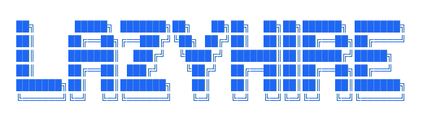

<p align="center"></p>

<p align="center">
<video autoplay loop muted playsinline>
<source src="https://github.com/user-attachments/assets/2fda985a-d86d-4191-873c-3026c7912d68" type="video/mp4">
</video>
</p>


<p align="center">
<strong>
AI-Assisted job search tooling. Resume in, decisions and applications out.
</strong>
</p>

<!-- Badges -->
<!--  -->

<!-- Hero GIF -->
<!--  -->

## The Problem

Job searching runs across too many tabs. You have the posting in one window, your resume in another, a blank cover letter doc open somewhere, and no consistent way to decide if a role is even worth applying to before you've already spent an hour on it.

`lazyhire` is built around one loop: build your profile once, add a job, get a fit score before writing anything, then generate what you need if you decide to apply. Everything stays local. Nothing requires leaving the terminal.

## Features

### Build your profile once

On first launch, import a hosted resume PDF or fill in your profile manually. `lazyhire` pulls out your experience, skills, targets, and deal-breakers and saves them locally. Every evaluation and every generated document draws from that profile, so you're not re-explaining yourself for each role.

<!--  -->

### Triage by score before spending time

Add a role from a URL or a pasted job description. `lazyhire` runs it against your profile and returns:

- an overall fit score
- matched and missing requirements
- seniority and role-fit breakdown
- a plain recommendation: apply, consider, or skip

That happens before you write anything, which is the point.

<!--  -->

### Generate tailored application material

For any saved job, generate a tailored resume PDF and cover letter PDF. Resume generation has multiple bullet-length presets and accepts an optional angle to steer the framing. Generated files attach back to the job record.

<!--  -->

### Prep interview answers

The answers workspace takes a question, classifies it, drafts a response in whatever tone you pick, and lets you refine it with follow-up instructions. Answers save to the job record so you can build a set before a screen or loop.

<!--  -->

## Workflow

```text
Resume → Profile → Add Job → Evaluate Fit → Generate Resume / Cover Letter → Prep Answers
```

The tool works best when your profile is accurate and the job descriptions you paste are complete.

## Install

### Prerequisites

- Chrome (or a Chromium-based browser) — used for PDF generation. Set `CHROME_PATH` if yours isn't in a standard location.
- [Claude Code](https://github.com/anthropics/claude-code) installed and authenticated — evaluation and document generation run through it.

```bash
curl -fsSL https://raw.githubusercontent.com/snesjhon/lazyhire/main/install.sh | bash
```

## Keyboard Shortcuts

| Key                 | Action                       |
| ------------------- | ---------------------------- |
| `a`                 | Add a job                    |
| `Tab` / `Shift+Tab` | Move between panels          |
| `[` / `]`           | Cycle filters or config tabs |
| `1` `2` `3`         | Jump between major panels    |
| `ctrl-q`            | Quit                         |

## Data

Everything is stored locally under `./.lazyhire`:

- `.lazyhire/candidate.json`
- `.lazyhire/jobs.json`
- `.lazyhire/answers.json`

Generated PDFs attach back to the saved job records.

## Development

### Requirements

- `bun`
- `pnpm`
- a working Claude Code setup, since evaluation and generation use `@anthropic-ai/claude-code`

## Inspiration

`lazyhire` started from looking at [career-ops](https://github.com/tylerbishopdev/career-ops). It covers the job search operations space well, but the scope was broader than what I needed. I wanted something more streamlined: one candidate, one terminal, a straight line from job description to application materials. That's what `lazyhire` is.

## License

MIT
